# DemoFX
Oldschool demo effects in C#

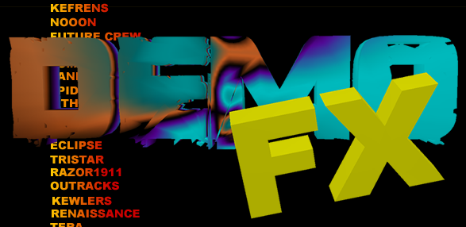</img>

Look ma no frameworks!

A project of dubious value to recreate some classic demo effects in C#, mainly ones you don't see very often or that are hard to find in C#. Done entirely in GDI+, no frameworks or OpenGL, just oldschool pixel pushing.

Salient points:
- this is a mess
- no, really
- we use reflection to pull out all demo classes that inherit from iDemo. Thus the interface's only purpose is to allow me to identify which classes are effects and which aren't. Once we have the classes, we create an instance of them and invoke the necessary methods. So that part is at least kind of extensible
- the problem is that all drawing is done from the DrawScreen class, so each effect class needs delegates to that class. Not so extensible
- we roll our own texture methods. Stick a texture in the resources file, then read the pixel values into a [,] array, stick them wherever you want and live with the bounds checks
- we avoid frameworks (except GDI+) because the old method of demo coding was to push your own pixels
- that being said, we use a standard cast-a-picturebox-to-a-bmp but then we use the FastBitmap class which uses pointers to manipulate the pixels
- few of these effects are originally mine though all have my work in them. Most are collected from the internet over many years and translated from whatever language (usually C or some flavor of pascal with embedded asm, much from HornetArchive) into C#. I'll take credit for the translation, optimization and getting them to work, but otherwise full credit for the original algorithms goes to the original authors (whoever those were).
- Caveat: in the old demoscene, figuring out who or what group actually came up with an effect first was not easy to determine. In most cases the PC demoscene reused older effects that had originated in the Amiga scene. Still, don't be a l4m3r. Give credit where it's due if you didn't come up with everthing yourself.
- I don't do copper bars. There is no way to do those in managed code, and not really a way to do them in assembly. Those were peculiar to the Amiga copper chip and drawing the bars is not how these were done. Even in assembly the closest I can get is to wait for in al,dx; and al,08h; and change the palette. It produces some cool effects but not really the same thing

Effects include:
- bobs
- rotozoomer
- plasma clouds
- tri-layer plasma
- xor
- waving landscape
- dot tunnel
- fractal
- vector balls
- shadebobs

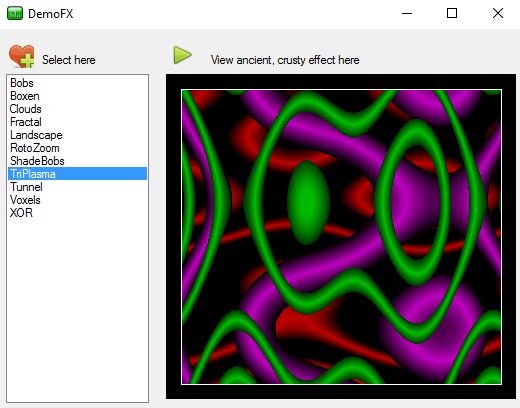</img> 

| Effect        | Image         | 
| ------------- |:-------------:|
| Voxels. Not very common. The examples I could find were from the mid-90's and very mysterious. This is adapted from a 1998 QB example by Toshihiro Horie.     | 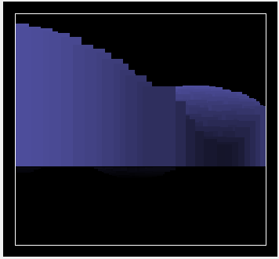</img> | 
| Dot landscape like Fake Demo from 93. Also not a very common effect.      | 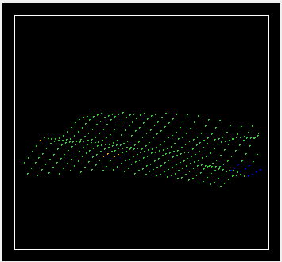</img>      | 
| Vector balls. Adapted from Tumblin/Bodies In Motion, 1994. | 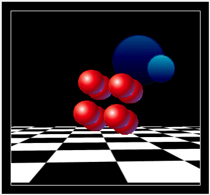</img>       | 
| Bobs. | 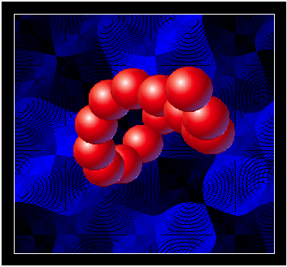</img>     | 
| Plasma clouds. I cheat by drawing the map once and then color cycling. | 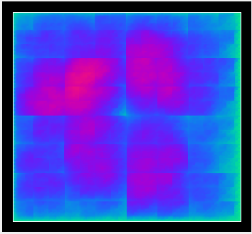</img>      | 
| Shadebobs. Uses angle arrays but not a heat structure so theres no cooling. To get around that we switch patterns. Loosely adapted from Flightcrank's example. | 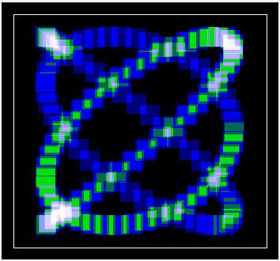</img>      | 
| Rotozoomer. | 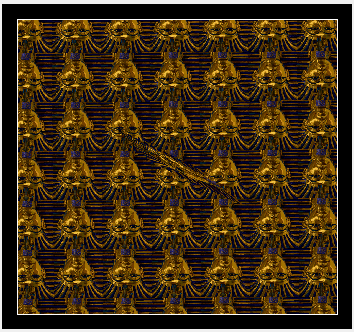</img>      | 
| Tri-layer plasma. Create a palette with a lot of black, then mask the black pixels. | 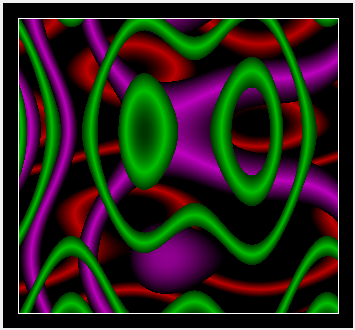</img>      | 
| XOR effects look very demo-y. | 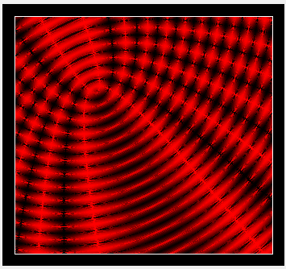</img>      | 
| Fractals. No matter how much you optimize the routine, you eventually run into the escape time algorithm which won't budge. | 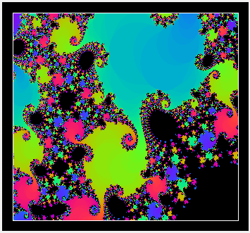</img>      | 
| Dot tunnel, adapted from an example by StoneMonkey in Freebasic. I'm going for the kind of look Xography got in their Crystal 2 BBS ad, for which no source exists. They've got some movement logic that eludes me. | 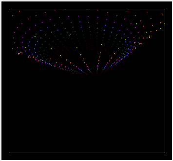</img>      | 
| Simple floorcasting. | 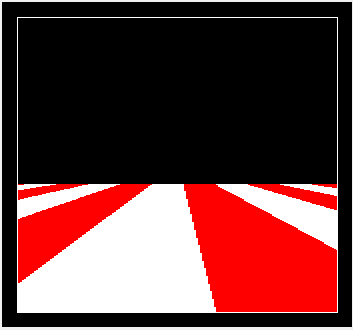</img>      | 
 
 

 

